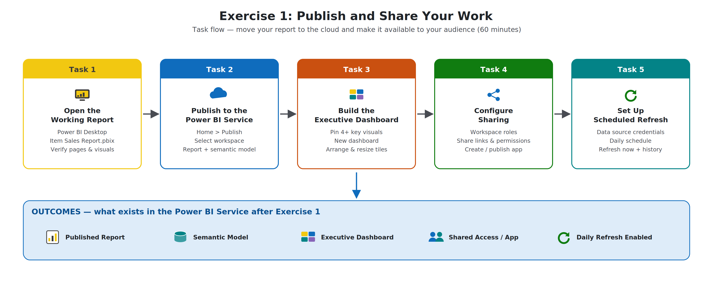

# Exercise 1: Publish and Share Your Work

### Estimated Duration: 60 Minutes

## 📘 Scenario

The **Item Sales Report** — a pre-built `.pbix` file provided in your lab environment — currently lives only in Power BI Desktop on your lab machine. Contoso Retail's leadership team wants this report available in the cloud — viewable from any device, summarized in a single executive dashboard, shared with the right people at the right permission level, and refreshed automatically every day.

In this exercise, you will move your report to the Power BI Service and make it available to your audience: you will publish the report and its semantic model, build a dashboard from its key visuals, review the three primary sharing methods, and configure scheduled refresh.

## 🎯 Objectives

In this exercise, you will complete the following tasks:

- Task 1: Launch the environment and open your working report
- Task 2: Publish from Power BI Desktop to the Power BI Service
- Task 3: Build a dashboard from report tiles
- Task 4: Configure sharing (workspace roles, apps, links)
- Task 5: Set up scheduled refresh

## 🧩 Architecture Diagram

   

## Task 1: Launch the environment and open your working report

In this task, you will open Power BI Desktop on the lab virtual machine and load the pre-built Item Sales Report provided for this lab. Verifying the report opens cleanly is an important checkpoint before publishing — any broken visuals or data errors will be carried into the Power BI Service.

1. On the lab VM, from the desktop or Start menu, open **Power BI Desktop**.

   

1. If a sign-in prompt appears, sign in with the following credentials:

   - **Email:** <inject key="AzureAdUserEmail"></inject>
   - **Password:** <inject key="AzureAdUserPassword"></inject>

   

1. On the **Home** ribbon, click **File (1)** and select **Open report (2)**, then click **Browse reports (3)**.

   

1. In the **Open** dialog, navigate to the path **C:\LabFiles** and select the **Item Sales Report.pbix (1)** file, then click **Open (2)**.

   

   > **Note**: If the file is not found at this path, check the **Resources/Files** section of your lab environment for the provided **Item Sales Report.pbix**.

1. Wait for the report to load completely.

1. Review each report page and confirm that all visuals render correctly without error icons.

   

1. If prompted to save pending changes from a previous session, click **Save**.

> **✅ Validation**: Confirm that the Power BI report opens successfully in Power BI Desktop and that all expected report pages and visuals are visible without errors.

## Task 2: Publish from Power BI Desktop to the Power BI Service

In this task, you will publish your report — and the semantic model behind it — from Power BI Desktop into a workspace in the Power BI Service. Publishing is the moment your report stops being a local file and becomes a shared cloud asset.

1. In Power BI Desktop, verify from the top-right corner of the window that you are signed in with your organizational account:

   - **Account:** <inject key="AzureAdUserEmail"></inject>

   

1. On the **Home** ribbon, click **Publish**.

   

1. If prompted to save your changes first, click **Save**.

   

1. In the **Publish to Power BI** dialog box, select the destination workspace **Workspace-<inject key="DeploymentID" enableCopy="false"/> (1)** and click **Select (2)**.

   

   > **Note**: If a dedicated lab workspace is not available in your environment, select **My workspace** instead.

1. Wait for the publishing process to complete. A success message appears when it is done.

1. On the success message, click **Open 'Item Sales Report.pbix' in Power BI** to open the published report in the browser.

   

1. If prompted, sign in to the Power BI Service with the same credentials.

1. In the left navigation pane, select **Workspaces (1)** and open **Workspace-<inject key="DeploymentID" enableCopy="false"/> (2)**.

   

1. Verify that the workspace now contains **both** of the following items:

   - The **Item Sales Report** (type: Report)
   - The **Item Sales Report** semantic model (type: Semantic model)

   

   > **Note**: The semantic model is published automatically alongside the report. It holds the data, relationships, and measures, and is the object you will configure for scheduled refresh in Task 5.

> **✅ Validation**: Confirm that the published workspace contains the report and the associated semantic model.

## Task 3: Build a dashboard from report tiles

In this task, you will create a consolidated executive view by pinning key report visuals to a new dashboard. Unlike a report, a dashboard is a single-page canvas that can combine tiles from multiple reports — ideal for at-a-glance monitoring by leadership.

1. In the Power BI Service, from the workspace, open the **Item Sales Report**.

   

1. Navigate to the first report page and identify a visual that represents a key business metric, such as the item-wise sales bar chart.

1. Hover over the visual and select the **Pin visual (1)** icon from the visual header.

   

1. In the **Pin to dashboard** window, select **New dashboard (1)** and enter the following name **(2)**, then click **Pin (3)**:

   ```
   Executive Dashboard
   ```

   

1. When the **Pinned to dashboard** confirmation appears, close it and remain on the report.

   

1. Repeat the pinning process for additional visuals — this time, in the **Pin to dashboard** window, select **Existing dashboard (1)**, ensure **Executive Dashboard (2)** is selected, and click **Pin (3)**.

   

1. Pin **at least four visuals** in total, from this page or other report pages, so that together they provide a meaningful executive summary (for example: total revenue, top items by quantity, a trend over time, and a KPI or card visual).

1. In the left navigation pane, select your workspace and open the **Executive Dashboard**.

   

1. Rearrange and resize the tiles by dragging them, so the layout reads cleanly — place the single most important metric at the top-left, where the eye lands first.

   

1. (Optional) Click **Edit (1)** > **Add a tile (2)** to explore additional tile types such as text boxes, images, and web content that can enrich a dashboard beyond pinned visuals.

   

> **✅ Validation**: Confirm that the Executive Dashboard contains at least four pinned visuals and presents a clear summary view of the report's key insights.

## Task 4: Configure sharing (workspace roles, apps, links)

In this task, you will review the three primary ways to share content in the Power BI Service — **workspace access** (roles for collaborators), **direct item sharing** (links and invitations for specific reports or dashboards), and **apps** (a packaged, read-only experience for broad audiences) — and understand when to use each.

1. In the Power BI Service, return to **Workspace-<inject key="DeploymentID" enableCopy="false"/>** and review its contents.

   

1. From the upper-right corner of the workspace, click **Manage access**.

   

1. In the **Manage access** pane, review the four available workspace roles:

   - **Admin** — full control, including managing workspace access and settings
   - **Member** — can edit, publish, and share content
   - **Contributor** — can create and edit content, but cannot manage access
   - **Viewer** — can only view and interact with content

   

1. Click **+ Add people or groups (1)**, enter a test user or group provided in your lab instructions, set the permission to **Viewer (2)** using the dropdown, and click **Add (3)**.

   

   > **Warning**: Only assign access in accordance with your lab instructions or organizational policy. If no test user is provided in your environment, review the role options and close the pane without adding anyone.

1. Open the **Item Sales Report** and, from the top menu, click **Share**.

   

1. In the **Send link** dialog, review the available direct sharing options:

   - **Sharing with specific people** — enter a name or email to send an invitation
   - **Copy link** — generate a shareable link with configurable permissions
   - **Link settings** — control whether recipients can share further or build content on the underlying data

   

1. Click the **link settings (gear/pencil) icon (1)**, review the audience options — **People in your organization**, **People with existing access**, and **Specific people** — and the additional permissions checkboxes, then click **Apply (2)**.

   

1. Close the sharing dialog and return to the workspace.

1. From the workspace toolbar, click **Create app**.

   

1. On the **Setup** tab, review and configure the following:

   - **App name (1)**: `Contoso Executive Insights`
   - **Description (2)**: `Board-ready sales insights for the Contoso executive team.`
   - Click **Next: Add content (3)**

   

1. On the **Content** tab, click **+ Add content (1)**, select the **Item Sales Report** and the **Executive Dashboard (2)**, click **Add (3)**, and review the navigation order, then click **Next: Add audience (4)**.

   

1. On the **Audience** tab, review how audiences control who sees which content, and review the audience access options.

   

1. If your environment allows app publishing, click **Publish app** and confirm. If publishing is blocked by tenant settings, review each configuration area and note its purpose, then close the app setup experience.

   

> **✅ Validation**: Confirm that you can identify the three primary sharing methods available in the Power BI Service — workspace access, direct item sharing, and app publishing — and describe when each is appropriate.

## Task 5: Set up scheduled refresh

In this task, you will configure the published semantic model to refresh on a schedule so that the report and dashboard always reflect current data without any manual steps.

1. In the workspace, locate the **Item Sales Report** semantic model.

1. Hover over the semantic model, click the **More options (…) (1)** menu, and select **Settings (2)**.

   

1. On the settings page, review the available sections:

   - **Gateway and cloud connections**
   - **Data source credentials**
   - **Refresh** (scheduled refresh)
   - **Refresh history** (accessible from the Refresh section or the semantic model's Refresh menu)

   

1. Expand **Data source credentials** and verify whether authentication is required for the data source.

1. If a credentials warning is displayed, click **Edit credentials (1)**, provide the appropriate **Authentication method (2)** for the lab data source, set the **Privacy level (3)** if prompted, and click **Sign in / Save (4)**.

   

   > **Note**: If your data source is an on-premises file, a data gateway is required for refresh. In this lab environment, review the **Gateway and cloud connections** section and note whether a gateway is configured.

1. Expand the **Refresh** section.

1. Toggle **Configure a refresh schedule** (Keep your data up to date) to **On (1)**.

1. Configure the schedule as follows:

   - **Refresh frequency (2)**: Daily
   - **Time zone (3)**: Select your local time zone
   - Click **Add another time (4)** and set a refresh time, such as **8:00 AM**

   

1. Optionally, enable the **Send refresh failure notifications** option so the dataset owner is notified when a refresh fails.

1. Click **Apply** to save the configuration.

   

1. Return to the workspace, hover over the semantic model, and click the **Refresh now (circular arrow)** icon to trigger an on-demand refresh and test your configuration.

   

1. Open the **Refresh history** for the semantic model and verify that the refresh completed successfully.

   

> **✅ Validation**: Confirm that scheduled refresh is enabled and a test refresh has succeeded — or identify and record the specific dependency preventing configuration, such as missing credentials or a required gateway.

> **Congratulations** on completing the exercise! Now, it's time to validate it. Here are the steps:
>
> - If you receive a success message, you can proceed to the next exercise.
> - If not, carefully read the error message and retry the step, following the instructions in the lab guide.
> - If you need any assistance, please contact us at cloudlabs-support@spektrasystems.com. We are available 24/7 to help you out.

<validation step="00000000-0000-0000-0000-000000000001" />

## 📝 Summary

In this exercise, you have accomplished the following:

- Opened and reviewed the existing report in Power BI Desktop
- Published the report and its semantic model to the Power BI Service
- Created an Executive Dashboard by pinning key report visuals
- Reviewed workspace roles, direct sharing, and app publishing
- Configured and tested scheduled refresh for the semantic model

### You have successfully completed the exercise. Click on **Next >>** to continue to the next exercise.


